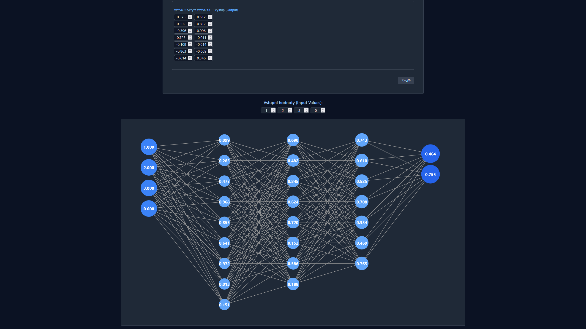

# Neural Network Visualizer



### DEMO APP
-   [DEMO-APP DEPLOYMENT](https://neural-network-nextjs-lnpd.vercel.app/)

**Neural Network Visualizer** is an application designed for visualizing and testing neural networks. The project was created as an experiment combining technical skills and the power of AI from OpenAI.

## 🛠️ Features/Technologies

### **Features**
- **Neural network visualization**: Intuitive representation of how layers and weights function.
- **Responsive design**: Fully optimized for both mobile and desktop devices.
- **Extensive configuration**: Ability to adjust weights, number of layers, and other parameters.
- **Interactive UI**: A user interface with fast responsiveness powered by React and Vite.

### **Technologies Used**
- **Frameworks**: React.js, Vite
- **Styling**: Tailwind CSS
- **Deployment**: Vercel
- **Libraries**: react-latex, react-mathjax

---

## 📦 Jak spustit projekt lokálně?

### 📦 Installation and Running the Application

1. **Install dependencies**:
   ```bash
   npm install
2. **Run the app**:
   ```bash
   npm run dev
3. **Open the application in your browser**:
   ```bash
   Navigate to: http://localhost:3000
